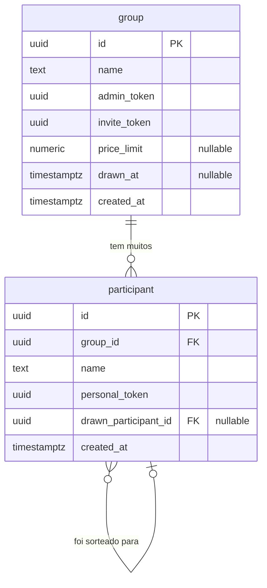

# 🛠️ Software Design Document (SDD)

**Projeto:** Amigo Secreto ou Inimigo
**Versão:** 1.0.0
**Status:** 🟡 Em Definição (MVP)

---

## 🤖 1. Orquestração e Contexto de IA (MCP)

> Configuração dos servidores Model Context Protocol para a IDE Agêntica.

- **Figma/Stitch MCP:** `[LINK DO ARQUIVO]` (Ler design tokens, cores e hierarquia visual).
- **Supabase MCP:** Contexto do banco de dados real e políticas de RLS — permite que a IA leia o schema, tabelas e políticas diretamente do projeto Supabase.
- **GitHub MCP:** Leitura das Issues do Kanban para orientar a implementação (Spec-Driven) — a IA implementa com base nas User Stories de US-01 a US-10.

---

## 📦 2. Stack Tecnológica e Bibliotecas

> Definição estrita das tecnologias permitidas (`package.json`). Nenhuma dependência externa deve ser instalada sem refletir aqui.

- **Core:** Angular 19+ (Standalone Components / Signals).
- **BaaS & Auth:** `@supabase/supabase-js` — banco de dados, autenticação e realtime.
- **Estilização & UI:** Tailwind CSS, Spartan UI (HLM), Lucide Angular (ícones).
- **Roteamento:** Angular Router com Functional Guards.
- **Formulários:** Angular Reactive Forms + `zod` (validação de schemas).
- **Utilitários:** `uuid` (geração de links únicos), `date-fns` (formatação de datas).
- **Testes:** Jest + Angular Testing Library.

---

## 🗄️ 3. Arquitetura de Dados

### 📖 3.1. Glossário Técnico (Mapeamento)

| Termo PRD (PT-BR) | Entidade Técnica (EN)                                                 | Atributos Principais                                                   |
| :---------------- | :-------------------------------------------------------------------- | :--------------------------------------------------------------------- |
| Grupo             | `group`                                                               | `id`, `name`, `admin_token`, `invite_token`, `price_limit`, `drawn_at` |
| Organizador       | Identificado pelo `admin_token`                                       | Não tem tabela própria — acesso via token                              |
| Participante      | `participant`                                                         | `id`, `group_id`, `name`, `personal_token`, `drawn_participant_id`     |
| Sorteio           | Campo `drawn_at` em `group` + `drawn_participant_id` em `participant` | Registro distribuído nas entidades                                     |
| Par               | `participant.drawn_participant_id`                                    | FK para outro `participant.id`                                         |
| Link de Convite   | `group.invite_token`                                                  | UUID v4 gerado na criação do grupo                                     |
| Link Individual   | `participant.personal_token`                                          | UUID v4 gerado na entrada do participante                              |
| Link de Admin     | `group.admin_token`                                                   | UUID v4 gerado na criação do grupo                                     |
| Valor Limite      | `group.price_limit`                                                   | `numeric`, nullable                                                    |
| Revelar           | Leitura de `participant.drawn_participant_id` via `personal_token`    | Só disponível após `group.drawn_at` não ser nulo                       |

---

### 📊 3.2. Diagrama ER (Mermaid)



---

## 📑 4. Contratos Globais (Interfaces & Types)

> Tipagem TypeScript baseada no schema do banco de dados.

```typescript
// src/app/core/models/group.model.ts

export interface Group {
  id: string;
  name: string;
  admin_token: string;
  invite_token: string;
  price_limit: number | null;
  drawn_at: string | null;
  created_at: string;
}

export type CreateGroupPayload = Pick<Group, "name" | "price_limit">;

export type GroupPublicView = Pick<Group, "id" | "name" | "price_limit" | "drawn_at">;
```

```typescript
// src/app/core/models/participant.model.ts

export interface Participant {
  id: string;
  group_id: string;
  name: string;
  personal_token: string;
  drawn_participant_id: string | null;
  created_at: string;
}

export type JoinGroupPayload = {
  group_id: string;
  name: string;
};

export type ParticipantPublicView = Pick<Participant, "id" | "name">;

export interface DrawResult {
  participant: ParticipantPublicView;
  drawn: ParticipantPublicView;
}
```

```typescript
// src/app/core/models/token.model.ts

export interface AdminTokenContext {
  groupId: string;
  adminToken: string;
}

export interface ParticipantTokenContext {
  groupId: string;
  personalToken: string;
}
```

---

## 🏗️ 5. Scaffolding Macro (Arquitetura Frontend)

### 📂 5.1. Estrutura de Pastas Base

```
src/
└── app/
    ├── core/
    │   ├── services/
    │   │   ├── group.service.ts
    │   │   ├── participant.service.ts
    │   │   └── draw.service.ts
    │   ├── guards/
    │   │   ├── admin-token.guard.ts
    │   │   └── participant-token.guard.ts
    │   └── models/
    │       ├── group.model.ts
    │       ├── participant.model.ts
    │       └── token.model.ts
    ├── features/
    │   ├── home/
    │   │   └── home.page.ts
    │   ├── create-group/
    │   │   └── create-group.page.ts
    │   ├── admin/
    │   │   └── admin.page.ts
    │   ├── join/
    │   │   └── join.page.ts
    │   └── reveal/
    │       └── reveal.page.ts
    ├── shared/
    │   ├── components/
    │   │   ├── participant-card/
    │   │   ├── copy-link-button/
    │   │   └── price-badge/
    │   └── pipes/
    │       └── currency-brl.pipe.ts
    └── app.routes.ts
```

- **`core/`** — Services globais singleton, Guards funcionais e Models/Interfaces TypeScript.
- **`features/`** — Smart Components (páginas) que gerenciam rotas e consomem services.
- **`shared/`** — UI Components (dumb), pipes e diretivas reutilizáveis e sem estado próprio.

---

### 🚦 5.2. Mapa de Rotas e Páginas (Features)

| Rota                      | Page Component                               | Guard                   | Descrição                                                                |
| :------------------------ | :------------------------------------------- | :---------------------- | :----------------------------------------------------------------------- |
| `/`                       | `features/home/home.page.ts`                 | Público                 | Tela inicial com botão para criar grupo                                  |
| `/criar`                  | `features/create-group/create-group.page.ts` | Público                 | Formulário de criação do grupo                                           |
| `/admin/:adminToken`      | `features/admin/admin.page.ts`               | `AdminTokenGuard`       | Painel do organizador: lista de participantes, sorteio e link de convite |
| `/entrar/:inviteToken`    | `features/join/join.page.ts`                 | Público                 | Tela de entrada do participante via link de convite                      |
| `/revelar/:personalToken` | `features/reveal/reveal.page.ts`             | `ParticipantTokenGuard` | Tela individual de revelação do par sorteado                             |

---

### 🧠 5.3. Core Services (Singleton)

| Service              | Arquivo                                | Responsabilidade Macro                                                                                    |
| :------------------- | :------------------------------------- | :-------------------------------------------------------------------------------------------------------- |
| `GroupService`       | `core/services/group.service.ts`       | Criar grupo, buscar grupo por `invite_token` ou `admin_token`, atualizar `price_limit`.                   |
| `ParticipantService` | `core/services/participant.service.ts` | Adicionar participante ao grupo, listar participantes, remover participante, buscar por `personal_token`. |
| `DrawService`        | `core/services/draw.service.ts`        | Executar o algoritmo de sorteio, persistir os pares no Supabase, marcar `group.drawn_at`.                 |

---

### ⚙️ 5.4. Algoritmo de Sorteio (DrawService)

O sorteio deve garantir que nenhum participante tire a si mesmo (derangement). Lógica sugerida:

```typescript
// Dentro de DrawService

function generateDraw(participants: Participant[]): Map<string, string> {
  const ids = participants.map((p) => p.id);
  let shuffled: string[];

  do {
    shuffled = [...ids].sort(() => Math.random() - 0.5);
  } while (shuffled.some((id, i) => id === ids[i])); // garante derangement

  return new Map(ids.map((id, i) => [id, shuffled[i]]));
}
```

> ⚠️ O sorteio só pode ser executado se `group.drawn_at === null` e `participants.length >= 3`.

---

## 🛡️ 6. Segurança (Supabase RLS)

> Políticas de acesso a nível de banco de dados. Toda leitura e escrita é validada pelo Supabase antes de chegar ao cliente.

| Tabela        | Operação                      | Política (RLS)                                                            |
| :------------ | :---------------------------- | :------------------------------------------------------------------------ |
| `group`       | `SELECT`                      | Permitido para qualquer um com `invite_token` ou `admin_token` válido.    |
| `group`       | `INSERT`                      | Permitido publicamente (criação sem login).                               |
| `group`       | `UPDATE`                      | Permitido apenas via `admin_token` correspondente ao `id` do grupo.       |
| `participant` | `SELECT`                      | Permitido para qualquer um com `invite_token` do grupo pai.               |
| `participant` | `SELECT drawn_participant_id` | Permitido apenas para o próprio participante via `personal_token`.        |
| `participant` | `INSERT`                      | Permitido publicamente via `invite_token` válido do grupo.                |
| `participant` | `DELETE`                      | Permitido apenas via `admin_token` e somente se `group.drawn_at IS NULL`. |
| `participant` | `UPDATE drawn_participant_id` | Permitido apenas pelo `DrawService` via service role (server-side).       |

> 🔒 **Regra crítica:** O campo `drawn_participant_id` nunca deve ser exposto via `SELECT` público — apenas via `personal_token` do próprio participante, evitando que alguém descubra os pares dos outros através da API.

---

_Amigo Secreto ou Inimigo — Documento confidencial para uso interno • v1.0.0 • 2026_
