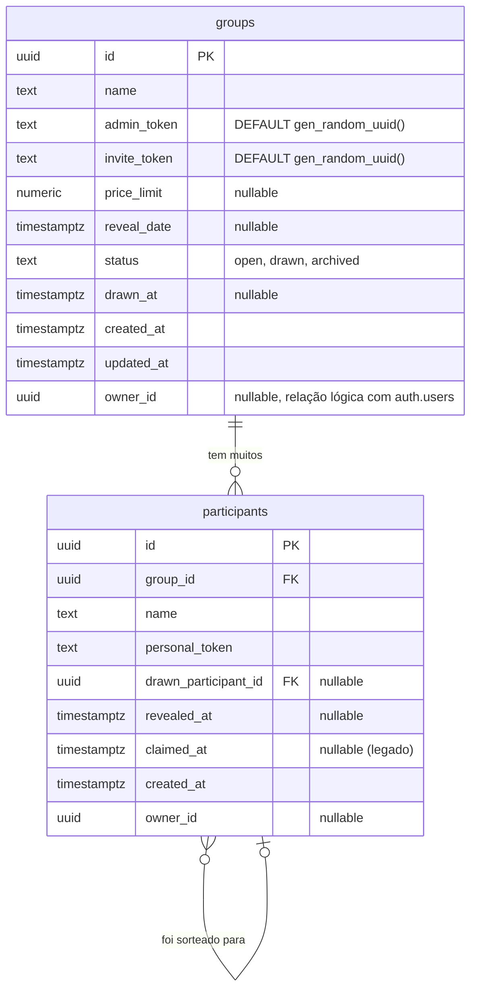

# 🛠️ Software Design Document (SDD)

**Projeto:** Amigo Secreto ou Inimigo
**Versão:** 2.0.0
**Status:** 🟢 Atualizado (Zoneless / Signals / Vitest / Supabase REST + RPCs / PWA)

---

## 🤖 1. Orquestração e Contexto de IA (MCP)

- **Supabase Local / Deno CLI:** desenvolvimento e testes do banco localmente via Docker (`supabase start`, `db reset`, Edge Functions).
- **MCP de Automação:** orquestração do plano de desenvolvimento, auditorias e cobertura de testes.
- **Vitest Unit Runner:** execução direta no workspace `apps/web` com inicialização mínima.

---

## 📦 2. Stack Tecnológica e Bibliotecas

- **Core:** Angular 21 (Standalone Components / Signals / Zoneless / `resource()` para dados assíncronos / `@defer` para carregamento sob demanda).
- **BaaS & Auth:** Supabase — PostgreSQL + PostgREST + Auth (GoTrue) + Edge Functions (Deno). Cliente REST **customizado via `HttpClient`** (sem a lib `@supabase/supabase-js` no browser).
- **PWA:** `@angular/service-worker` (ngsw) + `manifest.webmanifest` + ícones PNG.
- **Estilização & UI:** Tailwind CSS v4 (CSS-First) + DaisyUI v5.
- **Roteamento:** Angular Router — Functional Guards, **Functional Resolver** e **rotas filhas (nested)**.
- **Formulários:** Angular Reactive Forms.
- **Reatividade:** ponte RxJS ↔ Signals via `toSignal()` / `toObservable()`.
- **Testes & Qualidade:** Vitest + jsdom + `@analogjs/vitest-angular`, ESLint (Flat Config), Prettier.

> Tokens de grupo (`admin_token` / `invite_token`) são gerados **no servidor** (`DEFAULT gen_random_uuid()`, migration 007). `crypto.randomUUID()` é usado no cliente apenas para `id`s e para o `personal_token` de participantes adicionados pelo organizador.

---

## 🗄️ 3. Arquitetura de Dados

### 📖 3.1. Glossário Técnico

| Termo (PT-BR) | Entidade (EN) | Observação |
| :--- | :--- | :--- |
| **Grupo** | `group` | `id`, `name`, `admin_token`, `invite_token`, `price_limit`, `reveal_date`, `status`, `drawn_at`, `owner_id` |
| **Organizador** | `admin_token` / `owner_id` | Gerencia pelo link de admin; logado, vê o grupo no dashboard e pode remover participantes |
| **Participante** | `participant` | `id`, `group_id`, `name`, `personal_token`, `drawn_participant_id`, `revealed_at`, `claimed_at` |
| **Sorteio** | `drawn_at` / `status` | Distribuição (derangement) feita **atomicamente** na Edge Function `perform-draw` |
| **Par** | `participant.drawn_participant_id` | FK para outro participante (nunca exposto cru ao cliente) |
| **Link de Admin** | `group.admin_token` | "Senha" do organizador, gerada no servidor |
| **Link de Convite** | `group.invite_token` | Abre a página informativa de convite (orienta a usar o link individual) |
| **Link Individual** | `participant.personal_token` | Link privado de revelação `/revelar/<token>`. O organizador obtém os links via RPC `get_participant_links` e distribui um a cada pessoa |

> **Modelo de acesso do participante:** cada pessoa acessa o seu par pelo **link individual** (`/revelar/<personal_token>`), que é um segredo único — ninguém vê o par de outro, e funciona antes/depois do sorteio. (Um modelo anterior de "senha do grupo + reivindicar nome" foi descartado por permitir um membro ver o par de outro — ver migration 013.)

### 📊 3.2. Diagrama ER (Mermaid)



---

## 📑 4. Contratos Globais (Interfaces & Types)

> `apps/web/src/app/core/models/index.ts`.

```typescript
export type GroupStatus = 'open' | 'drawn' | 'archived';

export interface Group {
  id: string;
  name: string;
  admin_token: string;
  invite_token: string;
  price_limit: number | null;
  reveal_date: string | null;
  status: GroupStatus;
  drawn_at: string | null;
  created_at: string;
  updated_at: string;
  owner_id: string | null;
  join_password_hash?: string | null; // coluna legada (modelo de senha descartado)
}

export type CreateGroupPayload = {
  name: string;
  price_limit: number | null;
  reveal_date: string | null;
  owner_id?: string | null;
};

// Visão pública do grupo (sem admin_token). has_join_password é informativo.
export type GroupPublicView = Pick<
  Group, 'id' | 'name' | 'price_limit' | 'reveal_date' | 'status' | 'drawn_at'
> & { has_join_password?: boolean };

export interface Participant {
  id: string;
  group_id: string;
  name: string;
  personal_token: string;
  drawn_participant_id: string | null;
  revealed_at: string | null;
  created_at: string;
  owner_id: string | null;
  claimed_at: string | null;
}

// Visão pública (sem personal_token nem drawn_participant_id)
export type ParticipantPublicView = Pick<
  Participant, 'id' | 'name' | 'created_at' | 'claimed_at' | 'revealed_at'
>;

// Link individual de revelação — retornado SÓ ao admin (RPC get_participant_links)
export interface ParticipantLink {
  id: string; name: string; personal_token: string; revealed_at: string | null;
}

export interface MyDrawResult {
  participant: { id: string; name: string; revealed_at?: string | null };
  group: GroupPublicView;
  drawn: { id: string; name: string } | null;
}

export interface DrawResponse {
  drawn_at: string; participant_count: number; group_name: string;
}
```

---

## 🏗️ 5. Arquitetura Frontend

### 📂 5.1. Estrutura de Pastas (`apps/web/src/app`)

```
app/
├── core/
│   ├── guards/        admin-token · auth · guest · invite-token (Functional Guards)
│   ├── resolvers/     reveal.resolver (Functional Resolver — pré-carrega o par)
│   ├── interceptors/  auth.interceptor (token) · error.interceptor (erros)
│   ├── models/        index.ts
│   ├── services/      supabase-rest · auth · group · participant · reveal · draw · api-error
│   └── tokens/        supabase.tokens (SUPABASE_URL / SUPABASE_ANON_KEY via DI)
├── features/
│   ├── home/ · auth/(login,register) · create-group/ · groups/(groups.page + groups-shell)
│   ├── admin/ · join/ · reveal/ · group-closed/ · not-found/
├── shared/
│   ├── components/  app-avatar · user-menu · bottom-nav · desktop-header · desktop-sidebar
│   │               · dashboard-shell · mobile-shell · group-card · group-grid
│   │               · participant-row · info-badge
│   ├── layouts/     desktop-layout
│   └── pipes/       initials.pipe
├── app.component.ts · app.config.ts · app.routes.ts
```

### 🚦 5.2. Mapa de Rotas, Guards e Resolver

| Rota | Componente | Proteção | Observação |
| :--- | :--- | :--- | :--- |
| `/` | `HomePage` | `guestGuard` | Landing; logado → redireciona a `/grupos` |
| `/login` · `/registrar` | `LoginPage` · `RegisterPage` | `guestGuard` | Só deslogado |
| `/grupos` | `GruposShellComponent` | — | **Rota pai (layout)** com `<router-outlet>` |
| `/grupos` → `''` | `GroupsPage` | `authGuard` | **Rota filha** — dashboard do organizador |
| `/grupos/criar` → `'criar'` | `CreateGroupPage` | — (pública) | **Rota filha** — criação (com ou sem conta) |
| `/admin/:adminToken` | `AdminPage` | `adminTokenGuard` | Painel + links individuais |
| `/entrar/:inviteToken` | `JoinPage` | `inviteTokenGuard` | Página informativa (usar link individual) |
| `/revelar/:personalToken` | `RevealPage` | — + **`revealResolver`** | Resolver pré-carrega `get_my_draw` |
| `/grupo-encerrado` | `GroupClosedPage` | — | Aviso informativo |
| `**` | `NotFoundPage` | — | 404 |

- **Guards (ID19):** `auth.guard` (sessão), `guest.guard` (logado → /grupos), `admin-token.guard` e `invite-token.guard` (validam posse de token).
- **Resolver (ID19):** `reveal.resolver` (`ResolveFn<MyDrawResult|null>`) entrega os dados via `resolve: { resolvedDraw }`; `RevealPage` os recebe por `input()` (graças a `withComponentInputBinding()`).
- **Interceptors (ID23):** `auth.interceptor` injeta `apikey` + `Authorization: Bearer`; `error.interceptor` centraliza mensagens (inclui mapeamento dedicado de erros do GoTrue e não vaza erros crus do PostgREST).

### ⚡ 5.3. `@defer` (ID9 — Deferrable Views)

`GroupsPage` (desktop) carrega o `GroupGridComponent` sob demanda:

```html
@defer (on viewport) { <app-group-grid [groups]="desktopGroups()" /> }
@placeholder { <skeleton/> } @loading (minimum 200ms) { <spinner/> }
```

Resultado: o `GroupGridComponent` é code-split em um **chunk próprio**, baixado só quando entra na viewport. (Importante: o tipo `DesktopGroupCard` é importado como `type` para não manter o módulo eager e permitir o split.)

### 🧠 5.4. Core Services

- **`SupabaseRestService`**: wrapper sobre PostgREST (`select`, `insert` com `return=minimal`, `insertOne` com `return=representation`, `deleteOne`, `rpc`).
- **`AuthService`**: sessão Supabase Auth; expõe `session`/`user`/`accessToken` como **Signals** (`toSignal`) e `accessToken$` como **Observable** (`toObservable`) — ID25.
- **`GroupService`**: `createGroup`, `getGroupByAdminToken/InviteToken`, `getPublicGroupByInviteToken`, `getGroupsByOwnerId`, `getParticipantLinks(adminToken)`.
- **`ParticipantService`**: `getParticipantsByGroupId`, `addParticipant` (insert minimal), `removeParticipant` (RPC).
- **`RevealService`**: `getMyDraw`, `getMyParticipation`, `markRevealed` (RPCs).
- **`DrawService`**: dispara a Edge Function `perform-draw`.

---

## 🔐 6. Autenticação, Sessão e Reatividade (ID21 / ID25)

- Login/cadastro via Supabase Auth (`/auth/v1/token` e `/auth/v1/signup`). Sem confirmação de e-mail: o cadastro já retorna a sessão e faz **login automático** com redirecionamento a `/grupos`.
- A sessão (JWT) é guardada em `localStorage` e exposta por Signals; o `auth.interceptor` envia o `Bearer` em toda chamada ao Supabase.
- **Ponte RxJS ↔ Signals:** `auth.service.ts` usa `toSignal(this.sessionSubject)` e `toObservable(this.accessToken)`.

---

## ☁️ 7. CRUD e Edge Function (ID22)

- **Create:** `createGroup` (INSERT `groups`), `addParticipant` (INSERT `participants`).
- **Read:** grupos (`groups`/`groups_public`), participantes (`participants_public`), par (`get_my_draw`).
- **Update:** `mark_revealed` (grava `revealed_at`); sorteio (`drawn_at`/`status` via Edge Function).
- **Delete:** `remove_participant` (RPC; só o dono, antes do sorteio).

### Edge Function `perform-draw`
`POST /functions/v1/perform-draw { admin_token }` — roda com **service_role** (bypassa RLS): busca o grupo, valida, carrega participantes, gera o **derangement** (ninguém tira a si mesmo), grava os pares atomicamente e marca o grupo como `drawn`.

---

## 🛡️ 8. Segurança (RLS, Views e RPCs)

**Princípio:** nenhum participante (nem o organizador) consegue ver o par de outro. Colunas sensíveis (`personal_token`, `drawn_participant_id`) nunca saem por leitura pública — só por RPCs `SECURITY DEFINER` escopadas por token.

- **Views (bypassam RLS, sem colunas sensíveis):**
  - `participants_public` (id, group_id, name, revealed_at, created_at, owner_id, claimed_at) — migration 003/011.
  - `groups_public` (sem `admin_token`; + `has_join_password`) — migration 006/011.
- **RLS:** `groups` (SELECT público; UPDATE/DELETE só dono) e `participants` (INSERT público; SELECT direto revogado) — migration 005.
- **Grants:** tabelas criadas por migration **não** recebem grants automáticos → grants explícitos para `anon`/`authenticated` (migration 009) e para `service_role` em `groups`/`participants` (migration 012, necessária para a Edge Function).
- **RPCs `SECURITY DEFINER`:**
  | RPC | Para quê | Autorização |
  | :-- | :-- | :-- |
  | `get_my_draw(personal_token)` | Lê o par + `revealed_at` (leitura pura) | posse do `personal_token` |
  | `get_my_participation(personal_token)` | Contexto sem o par | posse do `personal_token` |
  | `mark_revealed(personal_token)` | Grava `revealed_at` (no clique "Revelar") | posse do `personal_token` |
  | `remove_participant(id)` | Remove participante | dono do grupo (`auth.uid() = owner_id`) e antes do sorteio |
  | `get_participant_links(admin_token)` | Lista name + personal_token para o admin distribuir | posse do `admin_token` |

### 8.1. Migrations (`apps/api/supabase/migrations`)

| # | Conteúdo |
| :-- | :-- |
| 000 | Schema base (`groups`, `participants`) |
| 001 | Índices nos tokens |
| 002 | Colunas `status`/`reveal_date`/`updated_at`/`revealed_at` + trigger |
| 003 | View `participants_public` + revoga SELECT direto + grants INSERT/DELETE |
| 004 | RPC `get_my_draw` (atualizada na 013 para incluir `revealed_at`) |
| 005 | Políticas RLS |
| 006 | View `groups_public` (sem `admin_token`) |
| 007 | Tokens de grupo `DEFAULT gen_random_uuid()` |
| 008 | RPCs `get_my_participation` + `mark_revealed` |
| 009 | Grants de tabela em `groups` (anon/authenticated) |
| 010 | RPC `remove_participant` (dono, antes do sorteio) |
| 011 | (descartado) Senha do grupo + claim — substituído pelo modelo de link individual |
| 012 | Grants de tabela em `groups`/`participants` para `service_role` (corrige o `perform-draw`) |
| 013 | Remove `claim_participant`/`set_group_password`; `get_my_draw` + `revealed_at`; RPC `get_participant_links` |

---

## 📱 9. PWA e DevOps (ID3 / ID28)

- **PWA:** `@angular/service-worker` com `ngsw-config.json` (prefetch do app-shell + JS/CSS com hash; lazy de ícones/mídia). `provideServiceWorker('ngsw-worker.js', { enabled: !isDevMode() })` em `app.config.ts` (ativo só em produção). `manifest.webmanifest` (`display: standalone`, `theme_color`, ícones PNG 192/512/maskable) + metas Apple/`viewport-fit=cover` no `index.html`.
- **Deploy (ID28):** build de produção `ng build` (gera `ngsw-worker.js`/`ngsw.json`); publicação automatizada da branch principal (ex.: Vercel) servindo `apps/web/dist/amigo-oculto/browser`.

---

## ✅ 10. Testes (ID33 — TDD com IA)

`vitest run` (`npm run test:unit`). Foco em **regras de negócio**:
- `draw.service.spec.ts`: algoritmo de **derangement** (ninguém se tira, cobre todos exatamente uma vez, mínimo de 3) + chamada da Edge Function.
- `admin-token.guard.spec.ts`: guard (token válido → `true`; inválido/erro/ausente → `UrlTree '/'`).

---

_Amigo Secreto ou Inimigo — Documento interno • v2.0.0 • 2026_
