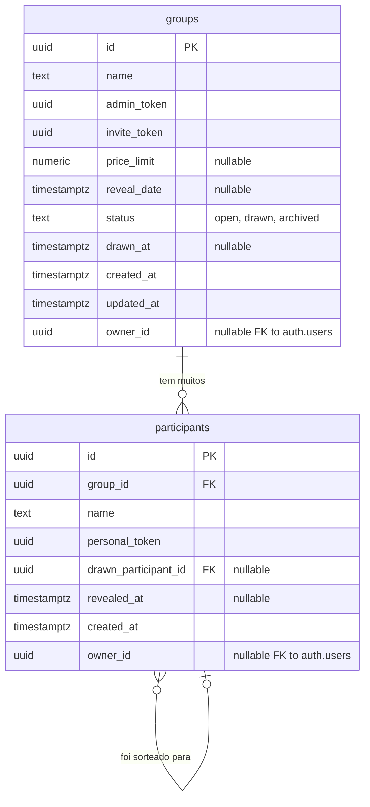

# 🛠️ Software Design Document (SDD)

**Projeto:** Amigo Secreto ou Inimigo
**Versão:** 1.0.0
**Status:** 🟢 Atualizado (Zoneless / Signals / Vitest / Supabase REST client)

---

## 🤖 1. Orquestração e Contexto de IA (MCP)

- **Supabase Local / Deno CLI:** Permite o desenvolvimento e testes do banco de dados localmente via Docker.
- **MCP de Automação:** Orquestração do plano de desenvolvimento e cobertura de testes.
- **Vitest Unit Runner:** Execução direta no workspace `apps/web` com tempo de inicialização mínimo.

---

## 📦 2. Stack Tecnológica e Bibliotecas

> Definição estrita das tecnologias utilizadas (`package.json`).

- **Core:** Angular 21 (Standalone Components / Signals / Zoneless / `resource()` API para gerenciamento de dados assíncronos).
- **BaaS & Auth:** Supabase REST Client customizado via HTTP (sem biblioteca pesada `@supabase/supabase-js` no client).
- **Estilização & UI:** Tailwind CSS v4 (CSS-First), DaisyUI v5.
- **Roteamento:** Angular Router com Functional Guards.
- **Formulários:** Angular Reactive Forms.
- **Utilitários:** API Web nativa `crypto.randomUUID()` para geração de tokens UUID v4.
- **Testes & Qualidade:** Vitest + jsdom + `@analogjs/vitest-angular` para testes unitários, ESLint (Flat Config) e Prettier.

---

## 🗄️ 3. Arquitetura de Dados

### 📖 3.1. Glossário Técnico (Mapeamento)

| Termo PRD (PT-BR) | Entidade Técnica (EN) | Atributos Principais |
| :--- | :--- | :--- |
| **Grupo** | `group` | `id`, `name`, `admin_token`, `invite_token`, `price_limit`, `reveal_date`, `status`, `drawn_at`, `owner_id` |
| **Organizador** | Identificado pelo `admin_token` ou `owner_id` | Dono ou criador do grupo, gerencia via link de admin |
| **Participante** | `participant` | `id`, `group_id`, `name`, `personal_token`, `drawn_participant_id`, `revealed_at` |
| **Sorteio** | Campo `drawn_at` / `status` | Registro distribuído nas entidades (atualizado atomicamente via Edge Function) |
| **Par** | `participant.drawn_participant_id` | FK de linkagem para outro participante do grupo |
| **Link de Convite** | `group.invite_token` | Token UUID v4 gerado no cadastro |
| **Link Individual** | `participant.personal_token` | Token UUID v4 gerado ao entrar no grupo |
| **Link de Admin** | `group.admin_token` | Token UUID v4 gerado para gerenciamento sem conta |

---

### 📊 3.2. Diagrama ER (Mermaid)



---

## 📑 4. Contratos Globais (Interfaces & Types)

> Tipagem TypeScript baseada no schema do banco de dados em `apps/web/src/app/core/models/index.ts`.

```typescript
export type GroupStatus = 'open' | 'drawn' | 'archived';

export interface Group {
  id: string;
  name: string;
  admin_token: string;
  invite_token: string;
  price_limit: number | null;
  reveal_date: string | null;
  status: GroupStatus;
  drawn_at: string | null;
  created_at: string;
  updated_at: string;
  owner_id: string | null;
}

export type CreateGroupPayload = {
  name: string;
  price_limit: number | null;
  reveal_date: string | null;
  owner_id?: string | null;
};

export type GroupPublicView = Pick<
  Group,
  'id' | 'name' | 'price_limit' | 'reveal_date' | 'status' | 'drawn_at'
>;

export interface Participant {
  id: string;
  group_id: string;
  name: string;
  personal_token: string;
  drawn_participant_id: string | null;
  revealed_at: string | null;
  created_at: string;
  owner_id: string | null;
}

export type JoinGroupPayload = {
  group_id: string;
  name: string;
};

export type ParticipantPublicView = Pick<Participant, 'id' | 'name' | 'created_at'>;

export interface MyDrawResult {
  participant: { id: string; name: string };
  group: GroupPublicView;
  drawn: { id: string; name: string } | null;
}

export interface AdminTokenContext {
  groupId: string;
  adminToken: string;
}

export interface ParticipantTokenContext {
  groupId: string;
  personalToken: string;
}

export interface DrawResponse {
  drawn_at: string;
  participant_count: number;
  group_name: string;
}
```

---

## 🏗️ 5. Scaffolding Macro (Arquitetura Frontend)

### 📂 5.1. Estrutura de Pastas de `apps/web`

```
apps/web/src/
└── app/
    ├── core/
    │   ├── guards/
    │   │   ├── admin-token.guard.ts
    │   │   ├── auth.guard.ts
    │   │   ├── guest.guard.ts
    │   │   └── invite-token.guard.ts
    │   ├── models/
    │   │   └── index.ts
    │   ├── services/
    │   │   ├── api-error.service.ts
    │   │   ├── auth.service.ts
    │   │   ├── draw.service.ts
    │   │   ├── group.service.ts
    │   │   ├── participant.service.ts
    │   │   ├── reveal.service.ts
    │   │   └── supabase-rest.service.ts
    │   └── tokens/
    │       └── supabase.tokens.ts
    ├── features/
    │   ├── admin/
    │   │   ├── admin.page.ts
    │   │   └── admin.page.html
    │   ├── auth/
    │   │   ├── login.page.ts
    │   │   └── register.page.ts
    │   ├── create-group/
    │   │   └── create-group.page.ts
    │   ├── group-closed/
    │   │   └── group-closed.page.ts
    │   ├── groups/
    │   │   └── groups.page.ts
    │   ├── home/
    │   │   └── home.page.ts
    │   ├── join/
    │   │   └── join.page.ts
    │   ├── not-found/
    │   │   └── not-found.page.ts
    │   └── reveal/
    │       └── reveal.page.ts
    ├── shared/
    │   ├── components/
    │   │   ├── card/
    │   │   ├── layout/
    │   │   └── toast/
    │   └── pipes/
    │       └── currency-brl.pipe.ts
    ├── app.component.ts
    ├── app.config.ts
    └── app.routes.ts
```

---

### 🚦 5.2. Mapa de Rotas e Guards

| Rota | Page Component | Guard | Descrição |
| :--- | :--- | :--- | :--- |
| `/` | `HomePage` | Público | Landing page, atalhos rápidos |
| `/login` | `LoginPage` | `guestGuard` | Acesso de organizador recorrente |
| `/registrar` | `RegisterPage` | `guestGuard` | Cadastro de organizador recorrente |
| `/criar` | `CreateGroupPage` | Público | Criação rápida de grupo |
| `/admin/:adminToken` | `AdminPage` | `adminTokenGuard` | Painel do organizador para o grupo |
| `/entrar/:inviteToken` | `JoinPage` | `inviteTokenGuard` | Tela de join do participante |
| `/revelar/:personalToken`| `RevealPage` | Público | Revelação do amigo secreto |
| `/grupos` | `GroupsPage` | `authGuard` | Painel centralizado do organizador logado |
| `/grupo-encerrado` | `GroupClosedPage` | Público | Aviso de que o sorteio já foi feito |
| `**` | `NotFoundPage` | Público | Erro 404 customizado |

---

### 🧠 5.3. Core Services

- **`SupabaseRestService`**: Wrapper genérico sobre a API PostgREST para realizar requisições HTTP autenticadas (via token anônimo ou Bearer JWT).
- **`AuthService`**: Gerenciador de sessão do usuário no Supabase Auth.
- **`GroupService`**: Gerencia criação, leitura e alteração de grupos.
- **`ParticipantService`**: Gerencia participantes vinculados ao grupo.
- **`RevealService`**: Gerencia a busca do Amigo Secreto via RPC seguro.
- **`DrawService`**: Dispara a Edge Function `perform-draw` para fazer o sorteio do grupo com segurança de transação atômica.

---

## ⚡ 6. Edge Functions

### 6.1. Função `perform-draw`

Para eliminar o vazamento de informações e garantir atomicidade completa, o sorteio é realizado no lado do servidor através de uma Supabase Edge Function (`apps/api/supabase/functions/perform-draw/index.ts`).

- **Endpoint:** `POST /functions/v1/perform-draw`
- **Payload:** `{ "admin_token": "string" }`
- **Fluxo Técnico:**
  1. Busca o grupo pelo `admin_token` e verifica se já foi realizado o sorteio.
  2. Carrega todos os participantes do grupo.
  3. Executa o algoritmo de *derangement* (embaralhamento garantindo que ninguém se tire).
  4. Realiza updates atômicos de todos os participantes associando-os aos seus respectivos pares.
  5. Atualiza o status do grupo para `drawn` e preenche `drawn_at`.

---

## 🛡️ 7. Segurança (Supabase RLS & Database Setup)

As seguintes políticas RLS e views garantem que nenhum participante possa ver quem os outros participantes tiraram.

```sql
-- Habilitar RLS nas tabelas
ALTER TABLE public.groups ENABLE ROW LEVEL SECURITY;
ALTER TABLE public.participants ENABLE ROW LEVEL SECURITY;

-- POLÍTICAS: GROUPS
CREATE POLICY "groups: public insert" ON public.groups FOR INSERT WITH CHECK (true);
CREATE POLICY "groups: read by invite_token" ON public.groups FOR SELECT USING (true);
CREATE POLICY "groups: update by owner" ON public.groups FOR UPDATE
  USING (auth.uid() = owner_id OR owner_id IS NULL)
  WITH CHECK (auth.uid() = owner_id OR owner_id IS NULL);

-- POLÍTICAS: PARTICIPANTS
CREATE POLICY "participants: read public fields by group" ON public.participants FOR SELECT
  USING (EXISTS (SELECT 1 FROM public.groups g WHERE g.id = group_id));

CREATE POLICY "participants: public insert" ON public.participants FOR INSERT WITH CHECK (true);

CREATE POLICY "participants: delete by group owner" ON public.participants FOR DELETE
  USING (
    EXISTS (
      SELECT 1 FROM public.groups g
      WHERE g.id = group_id
        AND g.drawn_at IS NULL
        AND (auth.uid() = g.owner_id OR g.owner_id IS NULL)
    )
  );

-- VIEW PÚBLICA DE PARTICIPANTES (OCULTA TOTALMENTE drawn_participant_id DO SELECT COMUM)
CREATE OR REPLACE VIEW public.participants_public AS
  SELECT id, group_id, name, personal_token, created_at, owner_id
  FROM public.participants;

GRANT SELECT ON public.participants_public TO anon, authenticated;
REVOKE SELECT ON public.participants FROM anon, authenticated;

-- RPC SEGURO PARA BUSCAR O PAR DO PARTICIPANTE (SECURITY DEFINER BYPASSA RLS CONTROLADAMENTE)
CREATE OR REPLACE FUNCTION public.get_my_draw(p_personal_token text)
RETURNS json
LANGUAGE plpgsql SECURITY DEFINER
AS $$
DECLARE
  v_participant participants%ROWTYPE;
  v_drawn       participants%ROWTYPE;
  v_group       groups%ROWTYPE;
BEGIN
  SELECT * INTO v_participant FROM participants WHERE personal_token = p_personal_token;
  IF NOT FOUND THEN RETURN NULL; END IF;

  SELECT * INTO v_group FROM groups WHERE id = v_participant.group_id;

  IF v_participant.drawn_participant_id IS NULL THEN
    RETURN json_build_object(
      'participant', json_build_object('id', v_participant.id, 'name', v_participant.name),
      'group', json_build_object('id', v_group.id, 'name', v_group.name, 'price_limit', v_group.price_limit, 'reveal_date', v_group.reveal_date, 'status', v_group.status, 'drawn_at', v_group.drawn_at),
      'drawn', null
    );
  END IF;

  -- Registra data de revelação se for a primeira vez
  IF v_participant.revealed_at IS NULL THEN
    UPDATE participants SET revealed_at = now() WHERE id = v_participant.id;
  END IF;

  SELECT * INTO v_drawn FROM participants WHERE id = v_participant.drawn_participant_id;

  RETURN json_build_object(
    'participant', json_build_object('id', v_participant.id, 'name', v_participant.name),
    'group', json_build_object('id', v_group.id, 'name', v_group.name, 'price_limit', v_group.price_limit, 'reveal_date', v_group.reveal_date, 'status', v_group.status, 'drawn_at', v_group.drawn_at),
    'drawn', json_build_object('id', v_drawn.id, 'name', v_drawn.name)
  );
END;
$$;
```

---

_Amigo Secreto ou Inimigo — Documento confidencial para uso interno • v1.0.0 • 2026_
