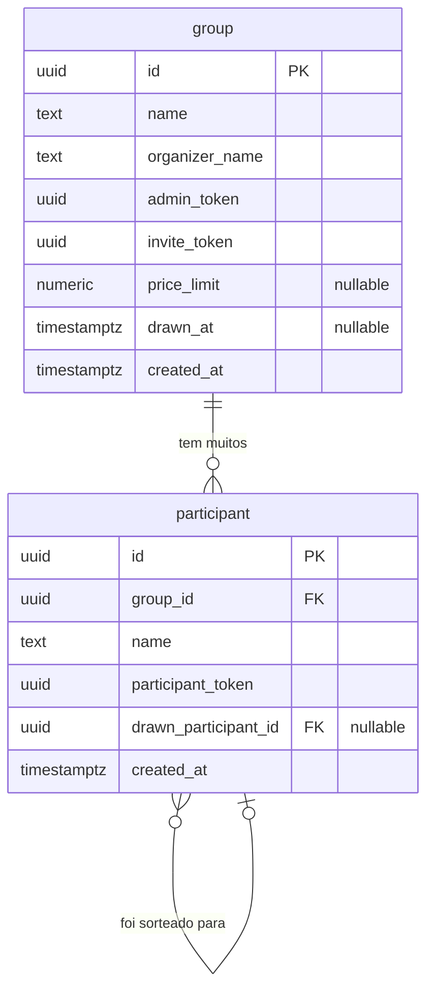

# 🛠️ Software Design Document (SDD)

**Projeto:** Amigo Secreto ou Inimigo?
**Versão:** 1.1.0
**Status:** 🟡 Em Definição (MVP)

---

## 🤖 1. Orquestração e Contexto de IA (MCP)

> Configuração dos servidores Model Context Protocol para a IDE Agêntica.

- **Figma/Stitch MCP:** `[LINK DO ARQUIVO]` (Ler design tokens, cores e hierarquia visual).
- **Supabase MCP:** Contexto do banco de dados real e políticas de RLS — permite que a IA leia o schema, tabelas e políticas diretamente do projeto Supabase.
- **GitHub MCP:** Leitura das Issues do Kanban para orientar a implementação (Spec-Driven) — a IA implementa com base nas User Stories de US-01 a US-07.

---

## 📦 2. Stack Tecnológica e Bibliotecas

> Definição estrita das tecnologias permitidas (`package.json`). Nenhuma dependência externa deve ser instalada sem refletir aqui.

- **Core:** Angular 19+ (Standalone Components / Signals).
- **BaaS:** `@supabase/supabase-js` — banco de dados, realtime e RLS. _(Sem autenticação de conta — acesso via tokens UUID v4)._
- **Estilização & UI:** Tailwind CSS, Spartan UI (HLM), Lucide Angular (ícones).
- **Roteamento:** Angular Router com Functional Guards.
- **Formulários:** Angular Reactive Forms + `zod` (validação de schemas).
- **Utilitários:** `uuid` (geração de tokens únicos), `date-fns` (formatação de datas).
- **Testes:** Jest + Angular Testing Library.

---

## 🗄️ 3. Arquitetura de Dados

### 📖 3.1. Glossário Técnico (Mapeamento PRD → Banco)

> Termos extraídos do Glossário Ubíquo do PRD v1.2.0. Use estes nomes estritamente no schema, interfaces e lógica de código.

| Termo PRD       | Entidade Técnica                                                      | Atributos Principais                                                                                   |
| :-------------- | :-------------------------------------------------------------------- | :----------------------------------------------------------------------------------------------------- |
| Group           | `group`                                                               | `id`, `name`, `organizer_name`, `admin_token`, `invite_token`, `price_limit`, `drawn_at`, `created_at` |
| Organizer       | Identificado pelo `admin_token`                                       | Sem tabela própria — acesso exclusivo via Admin Link                                                   |
| Participant     | `participant`                                                         | `id`, `group_id`, `name`, `participant_token`, `drawn_participant_id`, `created_at`                    |
| Draw            | Campo `drawn_at` em `group` + `drawn_participant_id` em `participant` | Registro distribuído nas entidades                                                                     |
| Par             | `participant.drawn_participant_id`                                    | FK para outro `participant.id`                                                                         |
| Invite Link     | `group.invite_token`                                                  | UUID v4 gerado na criação do grupo                                                                     |
| Individual Link | `participant.participant_token`                                       | UUID v4 gerado na entrada do participante                                                              |
| Admin Link      | `group.admin_token`                                                   | UUID v4 gerado na criação do grupo                                                                     |
| Price Limit     | `group.price_limit`                                                   | `numeric`, nullable                                                                                    |
| Group Status    | Derivado de `group.drawn_at` e `COUNT(participant)`                   | `waiting` / `ready` / `drawn` — ver regra abaixo                                                       |
| Reveal          | Leitura de `participant.drawn_participant_id` via `participant_token` | Só disponível após `group.drawn_at IS NOT NULL`                                                        |

> **Derivação de Group Status:**
>
> - `drawn` → `group.drawn_at IS NOT NULL`
> - `ready` → `group.drawn_at IS NULL` AND `COUNT(participants) >= 3`
> - `waiting` → `group.drawn_at IS NULL` AND `COUNT(participants) < 3`

---

### 📊 3.2. Diagrama ER (Mermaid)



> **Nota de mudança:** O campo foi renomeado de `personal_token` para `participant_token` para alinhar com o termo `Participant` do Glossário do PRD. O campo `organizer_name` foi adicionado à tabela `group` conforme US-02.

---

## 📑 4. Contratos Globais (Interfaces & Types)

> Tipagem TypeScript baseada no schema do banco de dados. Espelha fielmente o Glossário do PRD.

```typescript
export interface Group {
  id: string;
  name: string;
  organizer_name: string;
  admin_token: string;
  invite_token: string;
  price_limit: number | null;
  drawn_at: string | null;
  created_at: string;
}

export type GroupStatus = "waiting" | "ready" | "drawn";

export type CreateGroupPayload = Pick<Group, "name" | "organizer_name" | "price_limit">;

export type GroupPublicView = Pick<Group, "id" | "name" | "price_limit" | "drawn_at">;
```

```typescript
export interface Participant {
  id: string;
  group_id: string;
  name: string;
  participant_token: string;
  drawn_participant_id: string | null;
  created_at: string;
}

export type JoinGroupPayload = {
  group_id: string;
  name: string;
};

export type ParticipantPublicView = Pick<Participant, "id" | "name">;

export interface DrawResult {
  participant: ParticipantPublicView;
  drawn: ParticipantPublicView;
}
```

```typescript
export interface AdminTokenContext {
  groupId: string;
  adminToken: string;
}

export interface ParticipantTokenContext {
  groupId: string;
  participantToken: string;
}
```

---

## 🏗️ 5. Scaffolding Macro (Arquitetura Frontend)

### 📂 5.1. Estrutura de Pastas Base

```
src/
└── app/
    ├── core/
    │   ├── services/
    │   │   ├── group.service.ts
    │   │   ├── participant.service.ts
    │   │   └── draw.service.ts
    │   ├── guards/
    │   │   ├── admin-token.guard.ts
    │   │   └── participant-token.guard.ts
    │   └── models/
    │       ├── group.model.ts
    │       ├── participant.model.ts
    │       └── token.model.ts
    ├── features/
    │   ├── home/
    │   │   └── home.page.ts
    │   ├── create-group/
    │   │   └── create-group.page.ts
    │   ├── admin/
    │   │   └── admin.page.ts
    │   ├── join/
    │   │   └── join.page.ts
    │   └── reveal/
    │       └── reveal.page.ts
    ├── shared/
    │   ├── components/
    │   │   ├── participant-card/
    │   │   ├── copy-link-button/
    │   │   └── price-badge/
    │   └── pipes/
    │       └── currency-brl.pipe.ts
    └── app.routes.ts
```

- **`core/`** — Services globais singleton, Guards funcionais e Models/Interfaces TypeScript.
- **`features/`** — Smart Components (páginas) que gerenciam rotas e consomem services.
- **`shared/`** — UI Components (dumb), pipes e diretivas reutilizáveis e sem estado próprio.

---

### 🚦 5.2. Mapa de Rotas e Páginas (Features)

| Rota                         | Page Component                               | Guard                   | Descrição                                                                     |
| :--------------------------- | :------------------------------------------- | :---------------------- | :---------------------------------------------------------------------------- |
| `/`                          | `features/home/home.page.ts`                 | Público                 | Landing page com botão para criar grupo (Visitor)                             |
| `/criar`                     | `features/create-group/create-group.page.ts` | Público                 | Formulário de criação do grupo (US-02)                                        |
| `/admin/:adminToken`         | `features/admin/admin.page.ts`               | `AdminTokenGuard`       | Painel do organizador: lista de participantes, sorteio e links (US-03, US-04) |
| `/entrar/:inviteToken`       | `features/join/join.page.ts`                 | Público                 | Tela de entrada do participante via Invite Link (US-05, US-07)                |
| `/revelar/:participantToken` | `features/reveal/reveal.page.ts`             | `ParticipantTokenGuard` | Tela individual de revelação do par sorteado (US-06, US-07)                   |

> **Nota:** O parâmetro da rota foi renomeado de `:personalToken` para `:participantToken` para manter consistência com o glossário.

---

### 🧠 5.3. Core Services (Singleton)

| Service              | Arquivo                                | Responsabilidade Macro                                                                                                       |
| :------------------- | :------------------------------------- | :--------------------------------------------------------------------------------------------------------------------------- |
| `GroupService`       | `core/services/group.service.ts`       | Criar grupo, buscar por `invite_token` ou `admin_token`, atualizar `price_limit` e `organizer_name` (antes do Draw).         |
| `ParticipantService` | `core/services/participant.service.ts` | Adicionar participante ao grupo, listar participantes, remover participante (antes do Draw), buscar por `participant_token`. |
| `DrawService`        | `core/services/draw.service.ts`        | Executar o algoritmo de sorteio (derangement em ciclo único), persistir os pares no Supabase, marcar `group.drawn_at`.       |

---

### ⚙️ 5.4. Algoritmo de Sorteio (DrawService)

O sorteio deve garantir **derangement** (nenhum participante tira a si mesmo) e **ciclo único** (A → B → C → A, sem subgrupos isolados), conforme RN-02 e RN-03 do PRD.

```typescript
/**
 * Gera um derangement em ciclo único.
 * Ex.: [A, B, C, D] → A→B, B→C, C→D, D→A
 * Garante: nenhum auto-sorteio + sem subgrupos isolados.
 */
function generateDraw(participants: Participant[]): Map<string, string> {
  const ids = participants.map((p) => p.id);
  const shuffled = [...ids].sort(() => Math.random() - 0.5);

  const drawMap = new Map<string, string>();
  shuffled.forEach((id, i) => {
    drawMap.set(id, shuffled[(i + 1) % shuffled.length]);
  });

  return drawMap;
}
```

> ⚠️ **Pré-condições obrigatórias (validar antes de chamar):**
>
> - `group.drawn_at === null` — sorteio ainda não realizado (RN-05).
> - `participants.length >= 3` — quórum mínimo atingido (RN-01).
> - Após persistir os pares, atualizar `group.drawn_at = NOW()` para travar o grupo.

---

## 🛡️ 6. Segurança (Supabase RLS)

> Políticas de acesso a nível de banco de dados. Toda leitura e escrita é validada pelo Supabase antes de chegar ao cliente.

| Tabela        | Operação                      | Política (RLS)                                                                                                      |
| :------------ | :---------------------------- | :------------------------------------------------------------------------------------------------------------------ |
| `group`       | `SELECT`                      | Permitido para qualquer requisição com `invite_token` ou `admin_token` válido.                                      |
| `group`       | `INSERT`                      | Permitido publicamente — criação sem login (US-01, US-02).                                                          |
| `group`       | `UPDATE`                      | Permitido apenas via `admin_token` correspondente ao `id` do grupo e somente se `drawn_at IS NULL`.                 |
| `participant` | `SELECT` (campos públicos)    | Permitido para qualquer requisição com `invite_token` válido do grupo pai — expõe apenas `id` e `name`.             |
| `participant` | `SELECT drawn_participant_id` | Permitido **apenas** para o próprio participante via `participant_token` e somente se `group.drawn_at IS NOT NULL`. |
| `participant` | `INSERT`                      | Permitido publicamente via `invite_token` válido, somente se `group.drawn_at IS NULL` (RN-06).                      |
| `participant` | `DELETE`                      | Permitido apenas via `admin_token` e somente se `group.drawn_at IS NULL` (RN-07).                                   |
| `participant` | `UPDATE drawn_participant_id` | Permitido **exclusivamente** pelo `DrawService` via service role (server-side) — nunca exposto ao cliente.          |

> 🔒 **Regra crítica (RN-04 do PRD):** O campo `drawn_participant_id` nunca deve ser exposto via `SELECT` público ou via `admin_token` — somente via `participant_token` do próprio participante. Isso garante que nem outros participantes nem o próprio Organizador consigam descobrir os pares através da API.

---

_Amigo Secreto ou Inimigo? — Documento interno • v1.1.0 • 2026_
